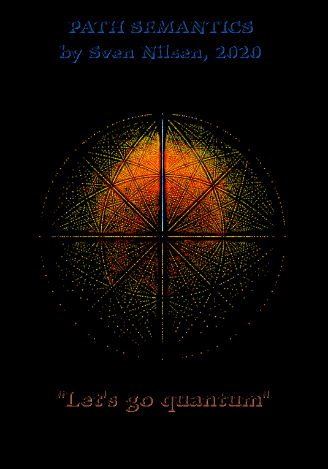

###### To generate images like this, see [Quantum Propagation Explorer](https://github.com/advancedresearch/path_semantics/blob/master/dyon_experiments/quantum_propagation/).

# Path Semantics
A research project in path semantics, a re-interpretation of functions for expressing mathematics

[Join us on Discord!](https://discord.gg/JkrhJJRBR2)

For an experimental implementation of a small subset of Path Semantics, see [Poi](https://crates.io/crates/poi).

[Transcript of Talk "Introduction to Path Semantics"](https://github.com/advancedresearch/path_semantics/blob/master/lectures/introduction-to-path-semantics/transcript-of-introduction-to-path-semantics.pdf) - This lecture was given to the Category Theory Study Group on the [Applied Category Theory server (Discord)](https://discord.com/invite/hTEpgYv).

Path Semantics is for people who want to develop deep intuition about mathematics.
This means you learn to understand mathematics well enough to build your own languages for theorem proving, e.g. from scratch.
The intuition of how to do this, comes from studying semantics of functions and programming by using functions.

- The semantics of functions is the fundament which programming is built upon.
- In mathematics, the functions modeled by Set Theory are pure (without side-effects and deterministic).
- Dependent Type languages uses pure functions to prove some properties of programs.

Path Semantics goes beyond Dependent Types to arbitrary sub-types, embraces undecidability and non-determinism.
The notation is designed to be used with point-free theorem proving (see [Poi](https://crates.io/crates/poi)) and can be used for analysis
when a type system is not sufficient to capture all the properties of mathematical objects.

"Let's go quantum" - (2020 slogan)

Here you will find lots of papers on ideas related to mathematics, logic, language and artificial intelligence.  
The common theme is to express mathematics in a way that is easier to read and understand for programmers.  

- [Reading sequences for learning Path Semantics](./sequences.md)
- [Reading sequences for Artificial Intelligence and Safety Research](./ai-sequences.md)
- [Frequently Asked Questions](https://github.com/advancedresearch/path_semantics/blob/master/faq.md)

Notice: This work has not yet been peer-reviewed,  
except informally and partially checked by automated theorem provers.

Blog posts:

- [2021-04-04 Deriving Path Semantics from First Principles](https://advancedresearch.github.io/blog/2021-04-04-deriving-path-semantics-from-first-principles)
- [2020-08-20 Improving Brute Force Theorem Proving](https://github.com/advancedresearch/advancedresearch.github.io/blob/master/blog/2020-08-20-improving-brute-force-theorem-proving.md)
- [2020-04-26 The Core Axiom](https://github.com/advancedresearch/advancedresearch.github.io/blob/master/blog/2020-04-26-the-core-axiom.md)
- [2020-01-18 The Secret Behind 2019 Logo](https://github.com/advancedresearch/advancedresearch.github.io/blob/master/blog/2020-01-18-the-secret-behind-the-2019-logo.md)
- [2018-12-09 Five Things You Should Know About Path Semantics](https://github.com/advancedresearch/advancedresearch.github.io/blob/master/blog/2018-12-09-five-things-you-should-know-about-path-semantics.md)
- [2017-08-25 Homotopy and Geometry](https://github.com/advancedresearch/advancedresearch.github.io/blob/master/blog/2017-08-25-homotopy-and-geometry.md)
- [2017-07-20 Generalizing Path Semantics to Probability Theory](https://github.com/advancedresearch/advancedresearch.github.io/blob/master/blog/2017-07-20-generalizing-path-semantics-to-probability-theory.md)
- [2017-06-28 Standardizing Path Semantics](https://github.com/advancedresearch/advancedresearch.github.io/blob/master/blog/2017-06-28-standardizing-path-semantics.md)
- [2017-06-25 Progress on Existential Paths](https://github.com/advancedresearch/advancedresearch.github.io/blob/master/blog/2017-06-25-progress-on-existential-paths.md)
- [2017-06-03 Perfect Intelligence](https://github.com/advancedresearch/advancedresearch.github.io/blob/master/blog/2017-06-03-perfect-intelligence.md)
- [2017-05-29 Golden Rationality](https://github.com/advancedresearch/advancedresearch.github.io/blob/master/blog/2017-05-29-golden-rationality.md)
- [2017-04-23 Existential Paths](http://blog.piston.rs/2017/04/23/existential-paths/)
- [2017-04-20 Slot Lambda Calculus](http://blog.piston.rs/2017/04/20/slot-lambda-calculus/)
- [2017-03-24 Proving Non-Existence of Monoid Symmetric Paths](http://blog.piston.rs/2017/03/24/proving-non-existence-of-monoid-symmetric-paths/)
- [2017-02-20 New Algorithm for Inferring Equations](http://blog.piston.rs/2017/02/20/new-algorithm-for-inferring-equations/)
- [2015-07-03 Path Semantics](http://blog.piston.rs/2015/07/03/path-semantics/)

### What is path semantics?

Here is a cheat sheet to show how it looks like: [Path Semantics Cheat Sheet](https://github.com/advancedresearch/path_semantics/blob/master/papers-wip/path-semantics-cheat-sheet.pdf)

Functional programming has been an active research area for [dependent types](https://en.wikipedia.org/wiki/Dependent_type).
In this notation, a new semantics that re-interprets functions takes a step beyond dependent types.

Very briefly, path semantics is about things like:

- How functions are constructed and connected
- How to express relationships between functions in a more strict way than equations
- What can be predicted about output of functions from something about the input
- What it means to refer to a function (function identity)
- What you can do with functions, given some class of knowledge about them is available
- What kind of structures are related to some class of functions

See the [wiki](https://github.com/advancedresearch/path_semantics/wiki) for more information.

### Why use path semantics?

Some problems require more powerful mathematical tools than others, e.g. AI safety research.  
Path semantics grounds meaning in "intrinsic complexity" of functions, similar to computational type theory,  
but builds up higher order concepts that stretches into the domain of philosophy.  
Therefore, path semantics offers an integrated understanding of semantics spanning a wide area of applications.

An advantage of path semantics is that one can translate to and from other languages.  
There are many such "bridges", from Logic to Lojban.  
Among the most important connections is one between probability theory and computation,  
which is formalized in path semantics.

### Is this a new programming language?

A new *kind* of programming language, but for mathematical thinking.

Mathematical ideas are expressed in terms of functions, which are easier to program than e.g. sets.
The purpose is to make mathematics more accessible and understandable in a way that relates to programming.

```
programming <------ path semantics ------> mathematics
```

Since programming and mathematis are very powerful tools on their own,
it is often easier to use them to design domain specific languages for problem solving.
However, doing so correctly, is easier by learning what mathematics can mean in terms of programming.

Goals:

- Create efficient algorithms that find paths
- Find deductive rules
- Find rules for well formed expressions
- Find applicable areas (machine learning etc.)
- Find generalizations (probability theory etc.)
