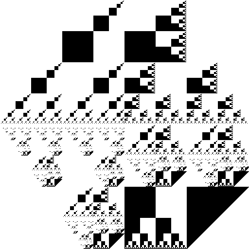

# Path Semantics
A research project in path semantics, a re-interpretation of functions for expressing mathematics

Official logo (2019):

[85, 164, 56, 161, 184, 74, 170, 85, 170, 170, 163, 43], or (4ab8a138a455 2ba3aaaa55aa)

The image above, with help from the code, describes a secret and beautiful mathematical language.
If you break the code, you receive the language in reward.
What kind of language is it? What can you prove with it?

Path Semantics is for people who want to develop deep intuition about mathematics.
This means you understand mathematics well enough to build your own languages for theorem proving, e.g. from scratch.
The intuition of how to do this, comes from studying semantics of functions and programming by using functions.

- The semantics of functions is the fundament which programming is built upon.
- In mathematics, the functions modeled by Set Theory are pure (without side-effects and deterministic).
- Dependent Type languages uses pure functions to prove some properties of programs.

The requirement that functions to be pure, makes it hard to prove some useful things.
Path Semantics goes beyond Dependent Types to arbitrary sub-types, embraces undecidability and non-determinism.
It brings you closer to the full meaning of mathematics, viewed through a perspective designed for programmers.

"Beyond pure functions" - (2019 slogan)

Here you will find lots of papers on ideas related to mathematics, logic, language and artificial intelligence.  
The common theme is to express mathematics in a way that is easier to read and understand for programmers.  
Learning path semantics will give you deep insights and a vehicle for thinking,  
which will open up *The Gate of Figuring Out Stuff*.

- [Tutorial](https://github.com/advancedresearch/path_semantics/wiki/Tutorial-1:-Types)  
- [A brief history of Path Semantics - illustrated with stick figures](https://github.com/advancedresearch/path_semantics/blob/master/papers-wip/history-of-path-semantics-illustrated.pdf)
- [How to think Abstractly with Path Semantics - illustrated](https://github.com/advancedresearch/path_semantics/blob/master/papers-wip/how-to-think-abstractly-with-path-semantics.pdf)
- [Reading sequences for learning Path Semantics](./sequences.md)
- [Reading sequences for Artificial Intelligence and Safety Research](./ai-sequences.md)
- [Mathematical Workflow Visualized](./workflow.md)
- [About Publishing Path Semantics](https://github.com/advancedresearch/path_semantics/blob/master/papers-wip/about-publishing-path-semantics.pdf)
- [Frequently Asked Questions](https://github.com/advancedresearch/path_semantics/blob/master/faq.md)

Notice: This work has not yet been peer-reviewed,  
except informally and partially checked by automated theorem provers.

Blog posts:

- [2018-12-09 Five Things You Should Know About Path Semantics](https://github.com/advancedresearch/advancedresearch.github.io/blob/master/blog/2018-12-09-five-things-you-should-know-about-path-semantics.md)
- [2017-08-25 Homotopy and Geometry](https://github.com/advancedresearch/advancedresearch.github.io/blob/master/blog/2017-08-25-homotopy-and-geometry.md)
- [2017-07-20 Generalizing Path Semantics to Probability Theory](https://github.com/advancedresearch/advancedresearch.github.io/blob/master/blog/2017-07-20-generalizing-path-semantics-to-probability-theory.md)
- [2017-06-28 Standardizing Path Semantics](https://github.com/advancedresearch/advancedresearch.github.io/blob/master/blog/2017-06-28-standardizing-path-semantics.md)
- [2017-06-25 Progress on Existential Paths](https://github.com/advancedresearch/advancedresearch.github.io/blob/master/blog/2017-06-25-progress-on-existential-paths.md)
- [2017-06-03 Perfect Intelligence](https://github.com/advancedresearch/advancedresearch.github.io/blob/master/blog/2017-06-03-perfect-intelligence.md)
- [2017-05-29 Golden Rationality](https://github.com/advancedresearch/advancedresearch.github.io/blob/master/blog/2017-05-29-golden-rationality.md)
- [2017-04-23 Existential Paths](http://blog.piston.rs/2017/04/23/existential-paths/)
- [2017-04-20 Slot Lambda Calculus](http://blog.piston.rs/2017/04/20/slot-lambda-calculus/)
- [2017-03-24 Proving Non-Existence of Monoid Symmetric Paths](http://blog.piston.rs/2017/03/24/proving-non-existence-of-monoid-symmetric-paths/)
- [2017-02-20 New Algorithm for Inferring Equations](http://blog.piston.rs/2017/02/20/new-algorithm-for-inferring-equations/)
- [2015-07-03 Path Semantics](http://blog.piston.rs/2015/07/03/path-semantics/)

### What is path semantics?

Here is a cheat sheet to show how it looks like: [Path Semantics Cheat Sheet](https://github.com/advancedresearch/path_semantics/blob/master/papers-wip/path-semantics-cheat-sheet.pdf)

Functional programming has been an active research area for [dependent types](https://en.wikipedia.org/wiki/Dependent_type).
In this notation, a new semantics that re-interprets functions takes a step beyond dependent types.

Very briefly, path semantics is about things like:

- How functions are constructed and connected
- How to express relationships between functions in a more strict way than equations
- What can be predicted about output of functions from something about the input
- What it means to refer to a function (function identity)
- What you can do with functions, given some class of knowledge about them is available
- What kind of structures are related to some class of functions

See the [wiki](https://github.com/advancedresearch/path_semantics/wiki) for more information.

### Why use path semantics?

Some problems require more powerful mathematical tools than others, e.g. AI safety research.  
Path semantics grounds meaning in "intrinsic complexity" of functions, similar to computational type theory,  
but builds up higher order concepts that stretches into the domain of philosophy.  
Therefore, path semantics offers an integrated understanding of semantics spanning a wide area of applications.

An advantage of path semantics is that one can translate to and from other languages.  
There are many such "bridges", from Logic to Lojban.  
Among the most important connections is one between probability theory and computation,  
which is formalized in path semantics.

### Is this a new programming language?

A new *kind* of programming language.

The project is about defining a new category of programming languages that satisfy a different method of expression compared to traditional languages.
The ideas are original, but inspired by recent advancement in type theory.

Goals:

- Create efficient algorithms that find paths
- Find deductive rules
- Find rules for well formed expressions
- Find applicable areas (machine learning etc.)
- Find generalizations (probability theory etc.)

### Previous work

Some ideas are taking from unpublished work. I have been asked to publish it but have not gotten time to do it yet.

Earlier, I explored ways to encode information into a generalized version of Adinkra diagrams to model states of discrete systems. The idea is since Adinkra diagrams are constructed by labeling the edges after specific rules, one could extract rules from edges of similar diagrams representing systems.

These diagrams have a reflective property that allows related concepts to be expressed with variations in a systematic way, intuitively described as "context modelling". This background knowledge, together with dependent type experiments, served as rationale for developing the notation.

While suitable to model context in various applications,
a problem is super exponential growth in memory usage.
Path semantics constructs a space that appear similar to the structure of such diagrams,
but compresses the information in a human readable form.

The diagrams have some important properties:

- Can be described fully using only an array of integers `[a, b, c, ...]`
- Uses direct group product as building block `[a, b] x [c, b] = [a, b, c, d]`
- The class with lowest complexity, `[2, 2, ...]`, are edges of hypercubes, as in Adinkra diagrams
- All diagrams are subset of itself in a single dimension `[N]`, which has the highest complexity

For algorithms to compute with these diagrams, see `Context` in the [discrete](https://github.com/bvssvni/discrete) library.
