# Quantum Propagation Explorer

[Quantum Propagation](https://github.com/advancedresearch/path_semantics/blob/master/papers-wip/quantum-propagation.pdf) is an algorithm that replaces
the Born rule for measurements with an infinite non-deterministic series (random paths) that converges to same probabilities.
The cover of random paths is a research topic in [Non-Deterministic Path Semantics](https://github.com/advancedresearch/path_semantics/blob/master/sequences.md#non-deterministic-path-semantics).

[Source](https://github.com/advancedresearch/path_semantics/blob/master/dyon_experiments/quantum_propagation/main.dyon)

For instructions, see comments in the source.

## Gallery

Here I post screenshots with formulas of interesting quantum functions.

The quantum function is `f` and the measurement is `g`.

- `g := and` is a shorthand for `g := \(a, b) = a && b`.
- `g := eq` is a shorthand for `g := \(a, b) = a == b`.

Each sample is a random path.

### Andor

- 20 000 samples
- `f := [(0, 1), (1, 0), (-1, 0), (0, 1)]`
- `g := and`

### Symmetric Andor

- 20 000 samples
- `f := [(0, 1), (2, 0), (-2, 0), (0, 1)]`
- `g := and`

### Secret Library (Random)
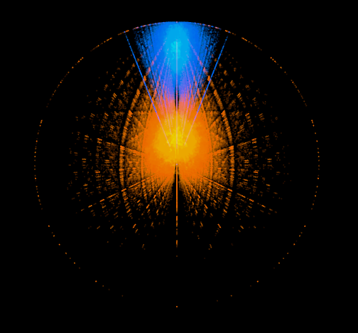
- 20 000 samples
- `f := [(0.53975284, 0.8347775), (-0.6443964, 0.28524667), (0.778826, 0.6626748), (0.84524584, 0.6032202)]`
- `g := eq`

### Gravitational Lock (Random)
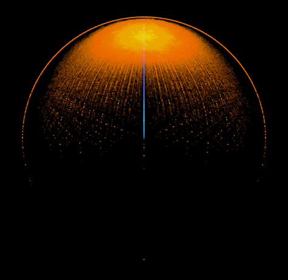
- 20 000 samples
- `f := [(-0.69797146, -0.024551803), (-0.2906545, 0.67269856), (-0.99042594, -0.5189728), (-0.6754978, -0.5213077)]`
- `g := and`

### Eruption (Random)
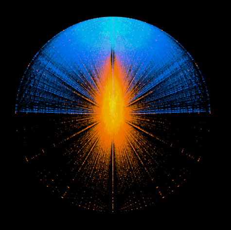
- 20 000 samples
- `f := [(-0.5742652, -0.66125774), (0.5340726, -0.1768929), (-0.94883776, -0.21300188), (0.98182935, -0.90915376)]`
- `g := eq`

### Dusty Lens (Random)
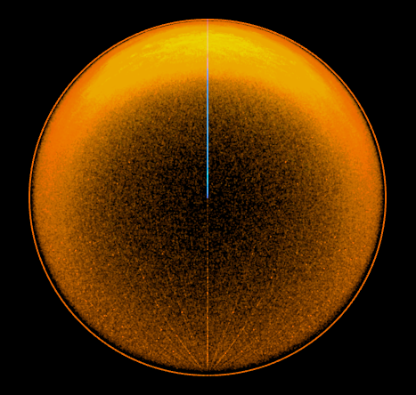
- 20 000 samples
- `f := [(-0.18238503, -0.70073056), (0.7934853, -0.77827376), (0.46978903, 0.9165352), (-0.07867549, -0.4303975)]`
- `g := and`

### Geysir (Random)
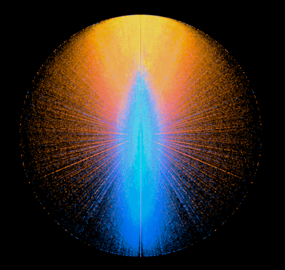
- 20 000 samples
- `f := [(0.8935131, 0.9591373), (-0.05023841, 0.4859118), (-0.89832544, -0.49549758), (-0.5120574, -0.7996857)]`
- `g := eq`

### Simulation (Random)
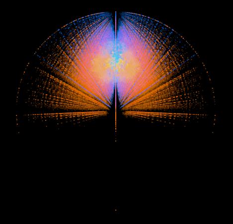
- 20 000 samples
- `f := [(0.87223727, -0.36542666), (0.52803975, 0.38853496), (0.65145344, -0.9732157), (0.123947814, -0.54745203)]`
- `g := eq`

### Intergalactic Road (Random)
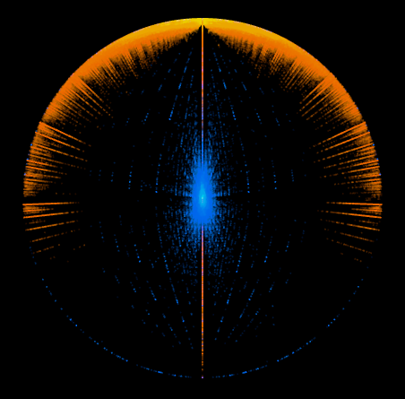
- 20 000 samples
- `f := [(0.15241292, -0.085435204), (-0.8511916, 0.57789814), (-0.27446622, -0.437507), (-0.10607258, 0.14709546)]`
- `g := eq`

### Dragonfly (Random)
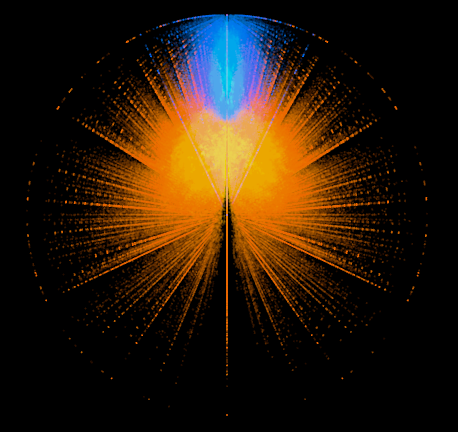
- 20 000 samples
- `f := [(-0.20913196, -0.8422289), (-0.995504, -0.16501884), (0.5780767, -0.83560455), (-0.42357144, -0.5135646)]`
- `g := eq`

### Messenger (Random)
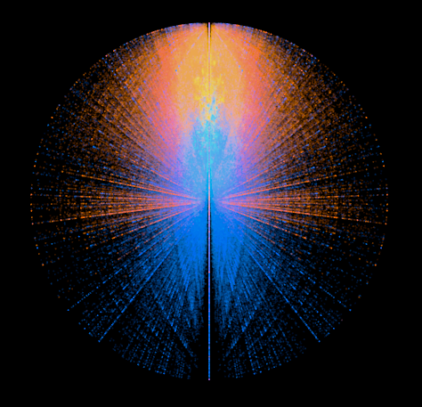
- 20 000 samples
- `f := [(0.101158865, -0.30092537), (-0.03949814, -0.29077327), (-0.8659539, 0.23232798), (0.34448284, 0.96728605)]`
- `g := eq`

### Sun (Random)
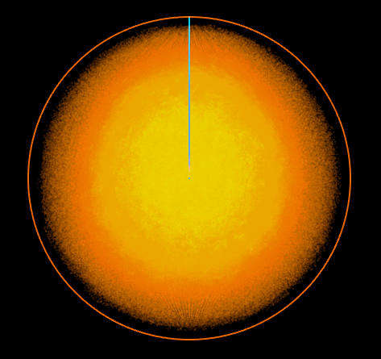
- 20 000 samples
- `f := [(-0.59925824, 0.08073656), (0.26387855, -0.9507098), (0.64888, 0.96241504), (0.9280084, -0.0011931247)]`
- `g := and`

### Citron Cake (Random)
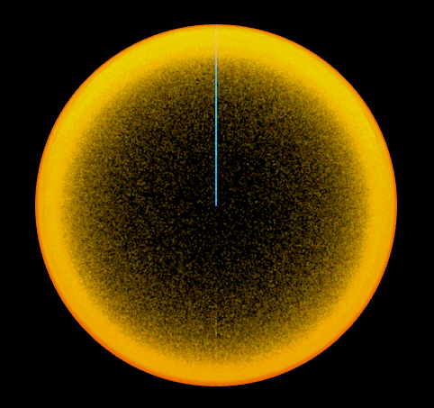
- 20 000 samples
- `f := [(-0.91212034, -0.9685161), (-0.9454618, 0.95944816), (0.96339244, 0.24654308), (0.15042756, 0.11154972)]`
- `g := and`
