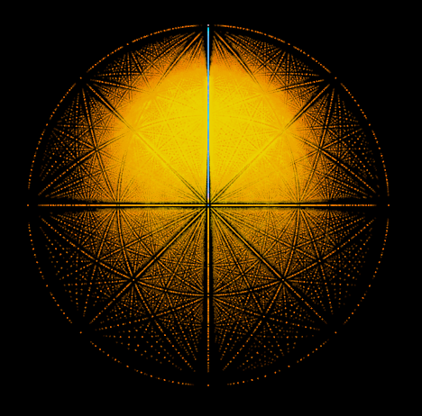
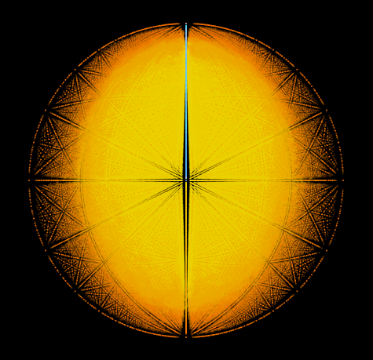

# Quantum Propagation Explorer

[Quantum Propagation](https://github.com/advancedresearch/path_semantics/blob/master/papers-wip/quantum-propagation.pdf) is an algorithm that replaces
the Born rule for measurements with an infinite non-deterministic series (random paths) that converges to same probabilities.
The cover of random paths is a research topic in [Non-Deterministic Path Semantics](https://github.com/advancedresearch/path_semantics/blob/master/sequences.md#non-deterministic-path-semantics).

[Source](https://github.com/advancedresearch/path_semantics/blob/master/dyon_experiments/quantum_propagation/main.dyon)

For instructions, see comments in the source.

## Gallery

Here I post screenshots with formulas of interesting quantum functions.

The quantum function is `f` and the measurement is `g`.

- `g := and` is a shorthand for `g := \(a, b) = a && b`.
- `g := eq` is a shorthand for `g := \(a, b) = a == b`.

### Andor

- 20 000 samples
- `f := [(0, 1), (1, 0), (-1, 0), (0, 1)]`
- `g := and`

### Symmetric Andor

- 20 000 samples
- `f := [(0, 1), (2, 0), (-2, 0), (0, 1)]`
- `g := and`
